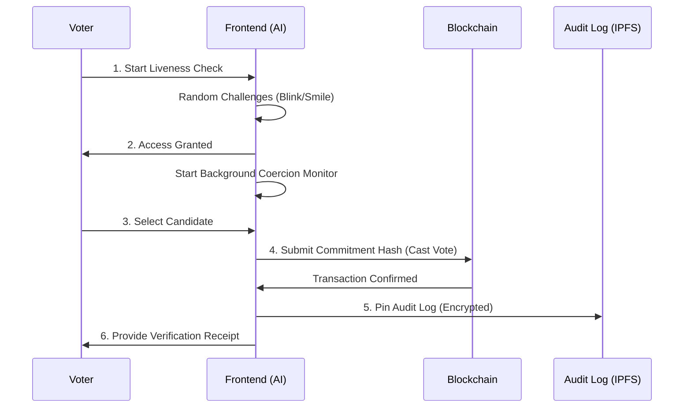

# System Architecture - Shield-Vote

Shield-Vote is a hybrid system combining decentralized ledger technology with localized artificial intelligence to create a secure, coercion-resistant voting environment.

## 🧱 Architectural Overview

The system follows a three-tier architecture:

### 1. Decentralized Execution Layer (Blockchain)
- **Smart Contract**: Written in Solidity (v0.8.20).
- **Consensus**: Currently runs on Ethereum-compatible EVM chains.
- **State Management**: Stores candidate information, encrypted voting commitments, and running tallies.
- **Privacy Model**: Uses a "Commitment & Reveal" pattern. Voters submit a hash of their choice plus a secret, ensuring the ballot remains secret while allow verification.

### 2. Identity & Hub Layer (Backend)
- **Engine**: Node.js & Express.
- **Database**: MongoDB for user state management.
- **Auth**: JWT-based session handling with OTP TTL (Time-To-Live).
- **Security**: Bcrypt password hashing and phone-base verification flow.

### 3. Intelligent Client Layer (Frontend & Edge AI)
- **Framework**: React.js with Vite for high-performance rendering.
- **Edge AI**: Utilizes Google MediaPipe (WASM-based) to perform inference directly in the voter's browser. No video data ever leaves the device, ensuring 100% privacy.
- **Liveness Engine**: A state machine that sequences random challenges to prevent spoofing.
- **Security Monitor**: A background thread that performs continuous pose and gaze analysis during the actual voting process.

### 3. Verification & Audit Layer
- **Audit Logs**: Candidate choices and transaction hashes are intended to be pinned to IPFS (currently mocked) for global availability.
- **Client-Side Verification**: An offline-capable module that regenerates commitment hashes to prove a vote's inclusion in the blockchain without revealing the user's secret to the network.

---

## 🛰️ Data Flow Diagram

## 🛡️ Security Mechanisms

| Mechanism | Component | Purpose |
| :--- | :--- | :--- |
| **Commitment Hash** | Contract | Prevents tally modification and keeps votes private. |
| **Edge Inference** | MediaPipe | Detects physical coercion without compromising camera privacy. |
| **Dummy Overwrite** | Contract | Allows a voter under duress to cast a "safe" vote and override it later. |
| **Last-Vote Wins** | Contract | Mitigates the impact of single-instance coercion. |
